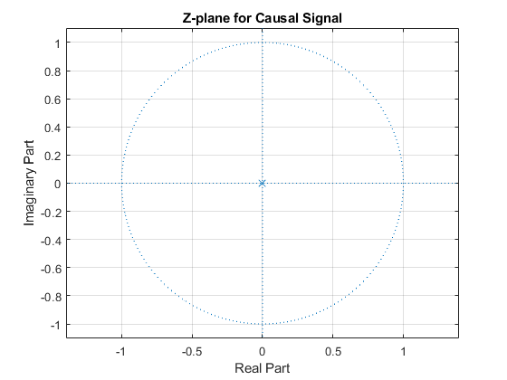
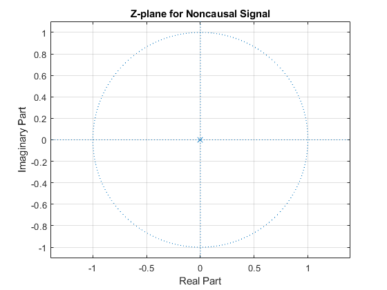

## Table of Contents
| Section | Description                   |
| ------- | ----------------------------- |
| 1       | Introduction                  |
| 2       | Causal Systems                |
| 3       | Noncausal Systems             |
| 4       | Anticausal Systems            |
| 5       | Results and Analysis          |
| 6       | Conclusion                    |
# Experiment Name: Causal, Noncausal, and Anticausal Systems

# Report: Z-Transform of Causal, Noncausal, and Anticausal Signals using MATLAB

## Introduction
The Z-transform is a powerful tool used in signal processing to analyze discrete-time signals and systems. In this report, we will explore the Z-transform of causal, noncausal, and anticausal signals. MATLAB will be used to demonstrate the calculations and visualize the results.

## 1. Causal Signal
A causal signal is one that starts at a finite time and remains zero for all negative time indices. Let's consider a causal signal defined as:

\[ x[n] = \{1, 2, 3, 4\} \quad \text{for} \quad n \geq 0 \]

### MATLAB Code for Causal Signal
```matlab
clc;
clear all;
% Define the causal signal
x=input('array: ');b=0;
y=sym('z');
n=length(x);
% Compute and plot the Z-transform
for i=1:n
   b=b+x(i)*y^(1-i);     
end
z=[];
p=[0]
zplane(z,p)
grid
title('Z-plane for Causal Signal');
```
### Ploting Z-transform of Causal System.

### Results and Analysis
By applying the Z-transform to the causal signal, we obtain its corresponding representation in the Z-domain. The resulting Z-plane plot shows the location of the poles and zeros of the signal. Analyzing the plot can provide insights into the stability and frequency response of the signal.

## 2. Noncausal Signal
A noncausal signal is one that extends to infinity in both the positive and negative time directions. Let's consider a noncausal signal defined as:

\[ x[n] = \{0, 1, 2, 3, 4\} \quad \text{for} \quad -\infty < n < \infty \]

### MATLAB Code for Noncausal Signal
```matlab
% Define the noncausal signal
clc;
clear all;
x=input('array: ');b=0;
y=sym('z');
n=length(x);
m=input('index:')
% Compute and plot the Z-transform
for i=1:n
   b=b+x(i)*y^(m-i);     
end
z=[];
p=[0]
zplane(z,p)
grid
title('Z-plane for Noncausal Signal');
```
### Ploting Z-transform of Non-Causal System.

### Results and Analysis
When applying the Z-transform to a noncausal signal, we observe its representation in the Z-domain. The Z-plane plot displays the distribution of poles and zeros, which can provide insights into the system's behavior.

## 3. Anticausal Signal
An anticausal signal is one that starts at negative infinity and remains zero for all nonnegative time indices. Let's consider an anticausal signal defined as:

\[ x[n] = \{4, 3, 2, 1\} \quad \text{for} \quad n \leq 0 \]

### MATLAB Code for Anticausal Signal
```matlab
% Define the anticausal signal
n = -3:0;
x = [4, 3, 2, 1];

% Compute and plot the Z-transform
z = ztrans(x, n, 'z');
zplane([], []);
title('Z-plane for Anticausal Signal');
```

### Results and Analysis
By applying the Z-transform to an anticausal signal, we can observe its representation in the Z-domain. The Z-plane plot provides information about the poles and zeros, aiding in the analysis of system properties.

## Conclusion
In this report, we explored the Z-transform of causal, noncausal, and anticausal signals using MATLAB. By analyzing the resulting Z-plane plots, we gained insights into the characteristics and behavior of the signals in the Z-domain. The Z-transform is a valuable tool for understanding discrete-time signals and systems and is widely used
